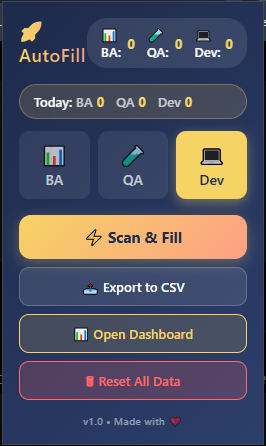
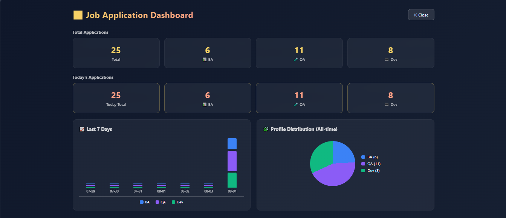
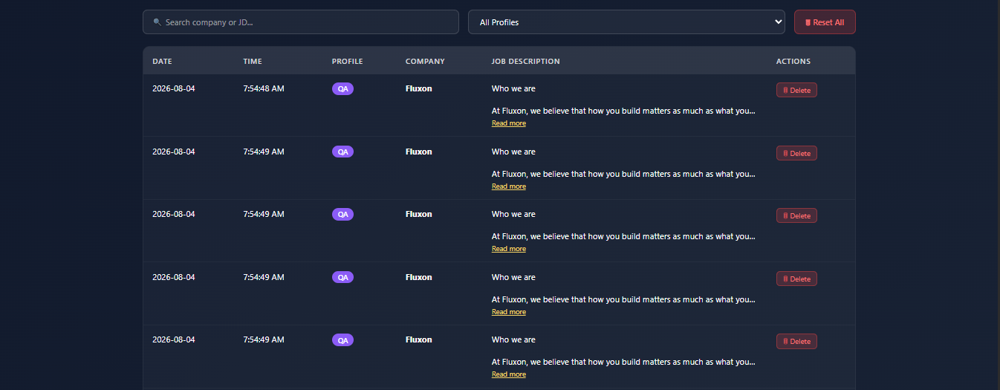

# 🚀 Job Form Autofill Extension

<p align="center">

A powerful Chrome Extension that automatically fills job application forms using predefined profiles.

Supports **QA**, **Business Analyst**, and **Developer** profiles with one click.


</p>

---

# 📸 Screenshots

## Extension Popup

<p align="center">

</p>

---

## Dashboard

<p align="center">

</p>

---

## Application History

<p align="center">

</p>

---

# ✨ Features

## 👤 Multiple Profiles

- 💼 Business Analyst
- 🧪 QA Engineer
- 💻 Developer

---

## ⚡ One Click Autofill

Automatically fills

- Full Name
- Email
- Phone Number
- LinkedIn
- GitHub
- Portfolio
- Country
- Experience
- Current Salary
- Expected Salary
- Notice Period
- Textareas
- Radio Buttons

---

## 📊 Dashboard

Track every application.

- Total Applications
- Today's Applications
- Profile Statistics
- Charts
- History

---

## 📄 Manual Resume Upload

Resume upload is intentionally manual so the user always has full control over which CV is submitted.

---

# 🌍 Supported Platforms

✅ Google Forms

🟡 Greenhouse (In Progress)

🟡 Lever (In Progress)

🟡 Workable (In Progress)

---

# 🛠 Tech Stack

- JavaScript (ES6)
- HTML5
- CSS3
- Chrome Extension API
- Manifest V3
- LocalStorage

---

# 📂 Project Structure

```
JobFormAutofill
│
├── assets
│   ├── resumes
│   └── screenshots
│
├── background.js
├── content.js
├── fieldMap.js
├── filler.js
├── manifest.json
├── matcher.js
├── popup.html
├── popup.js
├── profile.js
├── radioFiller.js
├── router.js
├── dashboard.html
├── dashboard.js
├── dashboard.css
└── styles.css
```

---

# 🚀 Installation

Clone the repository

```bash
git clone https://github.com/YOUR_USERNAME/job-form-autofill-extension.git
```

Open Chrome

```
chrome://extensions
```

Enable

```
Developer Mode
```

Click

```
Load unpacked
```

Select the project folder.

---

# 🎯 Usage

1. Open any job application form.
2. Click the extension.
3. Select a profile.

- QA
- Business Analyst
- Developer

4. Click

```
⚡ Scan & Fill
```

5. Upload your resume manually.

6. Submit the application.

---

# ✅ Completed

- Multiple Profiles
- Smart Field Detection
- Automatic Text Filling
- Google Forms Support
- Radio Button Support
- Dashboard
- Application History
- Statistics
- Export to CSV
- Search Applications

---

# 🚧 Roadmap

- Checkbox Support
- Dropdown Support
- Greenhouse Support
- Lever Support
- Workable Support
- AI Field Matching
- Cloud Sync
- Resume Manager
- Browser Sync

---

# 📈 Future Plans

- LinkedIn Easy Apply Support
- Indeed Support
- Glassdoor Support
- Workday Support
- Success Rate Analytics
- Interview Tracker

---

# 🤝 Contributing

Contributions, feature requests, and suggestions are welcome.

Feel free to fork this repository and submit a Pull Request.

---

# 📜 License

This project is licensed under the **MIT License**.

---

<p align="center">

⭐ If you like this project, consider giving it a star!

Made with ❤️ using JavaScript

</p>
